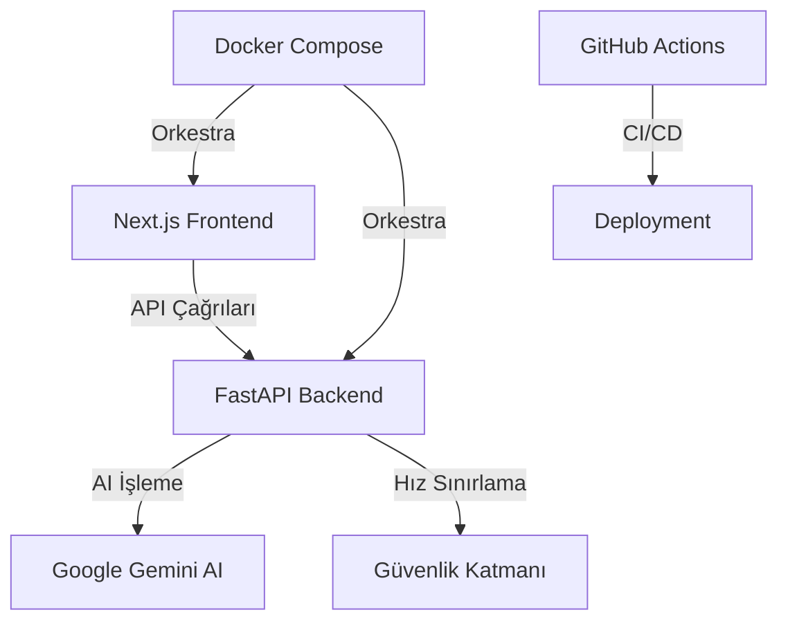
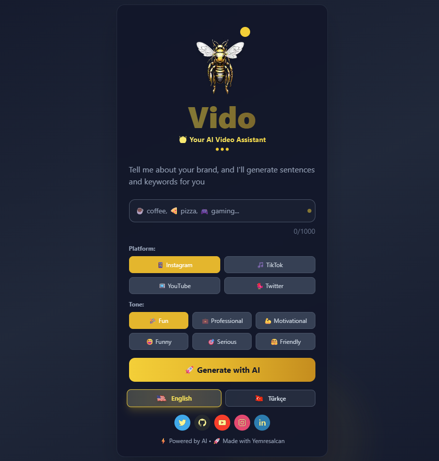
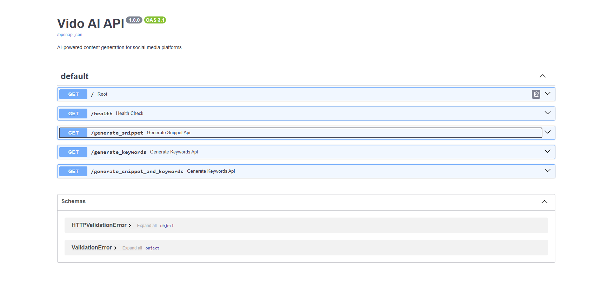

# 🎬 Vido AI - AI Destekli İçerik Üretim Asistanı

<div align="center">


**Sosyal medya platformları için AI destekli içerik üretimi yapan modern web uygulaması. Google Gemini AI ile platform-spesifik, ton-ayarlı ve çok dilli içerik oluşturur.**

[🚀 Canlı Demo](https://vido-ai.vercel.app) • [📖 Dokümantasyon](https://github.com/Yemresalcan/vido-ai/wiki) • [🇺🇸 English](./README.md)

</div>

---

## ✨ Özellikler

### 🎯 Çoklu Platform Desteği
- **📱 Instagram** - Görsel odaklı içerik ve etkileyici açıklamalar
- **🎵 TikTok** - Viral olan kısa form video içerikleri  
- **📺 YouTube** - Uzun form video açıklamaları ve başlıkları
- **🐦 Twitter** - Kısa ve etkili tweetler

### 🎭 Ton Özelleştirme
- **💼 Profesyonel** - İş dünyası ve kurumsal içerik
- **🤗 Samimi** - Kişisel marka ve günlük içerik
- **😄 Komik** - Mizahi ve eğlenceli paylaşımlar
- **📚 Eğitici** - Bilgilendirici ve öğretici içerik
- **💪 Motivasyonel** - İlham verici ve güçlendirici mesajlar
- **🎯 Ciddi** - Resmi ve otoriter ton

### 🌍 Çok Dilli Destek
- **🇹🇷 Türkçe** ve **🇺🇸 İngilizce** tam destek
- Her iki dilde AI çıktıları ve arayüz
- Otomatik dil algılama ve uyarlanma

### 🎨 Modern UI/UX
- AI temalı glassmorphism tasarım
- Tamamen responsive ve mobil dostu
- Dark mode optimize edilmiş arayüz
- Akıcı animasyonlar ve mikro etkileşimler
- Gerçek zamanlı hata yönetimi ve geri bildirim

---

## 🏗️ Mimari

<div align="center">



</div>

```
vido-ai/
├── 🎨 vido-site/              # Next.js Frontend
│   ├── components/            # React bileşenleri
│   ├── pages/                # Next.js sayfaları
│   ├── types/                # TypeScript tanımları
│   └── public/               # Statik dosyalar
│
├── 🔧 app/                   # Python Backend (FastAPI)
│   ├── vido_api.py          # API endpoint'leri
│   ├── vido.py              # AI logic ve içerik üretimi
│   └── requirements.txt     # Python bağımlılıkları
│
├── 🐳 Docker Dosyaları       # Konteynerleştirme
├── 🔄 .github/workflows/     # CI/CD pipeline'ları
└── 📚 Dokümantasyon
```

---

## 🚀 Hızlı Başlangıç

### 📋 Ön Gereksinimler

- **Python 3.9+**
- **Node.js 18+**
- **Google Gemini AI API Key** ([Buradan alın](https://aistudio.google.com/app/apikey))

### 🐳 Docker Kurulumu (Önerilen)

1. **Repository'yi klonlayın**
   ```bash
   git clone https://github.com/Yemresalcan/vido-ai.git
   cd vido-ai
   ```

2. **Environment yapılandırması**
   ```bash
   cp app/env.example app/.env
   echo "GEMINI_API_KEY=your_actual_api_key_here" >> app/.env
   ```

3. **Docker Compose ile başlatın**
   ```bash
   # Production mode
   docker-compose up -d
   
   # Development mode (hot reload ile)
   docker-compose -f docker-compose.dev.yml up -d
   ```

4. **Uygulamaya erişin**
   - 🌐 **Frontend**: [http://localhost:3000](http://localhost:3000)
   - ⚡ **Backend**: [http://localhost:8000](http://localhost:8000)
   - 📖 **API Dokümanları**: [http://localhost:8000/docs](http://localhost:8000/docs)

### 🚀 Opsiyonel: Docker Hub Kurulumu
Release'lerde otomatik Docker image yayınlamayı etkinleştirmek için:
1. GitHub Repository → Settings → Secrets and variables → Actions
2. `DOCKERHUB_USERNAME` ekleyin (Docker Hub kullanıcı adınız)
3. `DOCKERHUB_TOKEN` ekleyin (Docker Hub erişim token'ı)
4. `.github/workflows/release.yml` dosyasında `if: false` kısmını `if: true` yapın

### 💻 Manuel Kurulum

<details>
<summary>Manuel kurulum talimatlarını görmek için tıklayın</summary>

#### Backend Kurulumu
```bash
cd app
python -m venv venv
source venv/bin/activate  # Linux/Mac
# venv\Scripts\activate    # Windows

pip install -r requirements.txt
cp env.example .env
# .env dosyasına GEMINI_API_KEY'inizi ekleyin

python vido_api.py
```

#### Frontend Kurulumu
```bash
cd vido-site
npm install
npm run dev
```

</details>

---

## 🔧 Kullanım

### 🎮 Web Arayüzü

1. **Açın** [http://localhost:3000](http://localhost:3000)
2. **Dil seçin** 🇹🇷/🇺🇸 bayrak butonlarını kullanarak
3. **Platform seçin** (Instagram, TikTok, YouTube, Twitter)
4. **Ton belirleyin** (Profesyonel, Samimi, Komik, vb.)
5. **Anahtar kelime girin** veya konu açıklaması yazın
6. **İçerik oluşturun** AI büyüsü ile ✨

### 📡 API Kullanımı

```bash
# Instagram için profesyonel ton ile içerik oluştur
curl "http://localhost:8000/generate_snippet_and_keywords?prompt=kahve&platform=instagram&tone=profesyonel&language=turkish"

# Yanıt
{
  "snippet": "Sabah rituelinizi premium kahve karışımımızla mükemmelleştirin ☕",
  "keywords": ["kahve", "sabah", "premium", "karışım", "rituel"]
}
```

---

## 🛠️ Teknoloji Yığını

### 🎨 Frontend
| Teknoloji | Amaç | Versiyon |
|-----------|------|----------|
| **Next.js** | React framework | 13+ |
| **TypeScript** | Tip güvenliği | 5.2+ |
| **Tailwind CSS** | Stil | 3.3+ |
| **React Icons** | İkon kütüphanesi | En son |

### ⚡ Backend
| Teknoloji | Amaç | Versiyon |
|-----------|------|----------|
| **FastAPI** | Python web framework | 0.104+ |
| **Google Gemini AI** | İçerik üretimi | En son |
| **Uvicorn** | ASGI server | 0.24+ |
| **Python-dotenv** | Environment yönetimi | 1.0+ |

### 🔧 DevOps
| Teknoloji | Amaç |
|-----------|------|
| **Docker & Docker Compose** | Konteynerleştirme |
| **GitHub Actions** | CI/CD Pipeline |


---

## 📡 API Referansı

### Temel URL
```
http://localhost:8000
```

### Endpoint'ler

#### `GET /generate_snippet_and_keywords`

Sosyal medya platformları için AI içerik ve anahtar kelimeler üretir.

**Parametreler:**
| Parametre | Tip | Gerekli | Varsayılan | Açıklama |
|-----------|-----|---------|------------|----------|
| `prompt` | string | ✅ | - | İçerik konusu veya anahtar kelime |
| `platform` | string | ❌ | `instagram` | Hedef platform |
| `tone` | string | ❌ | `eglenceli` | İçerik tonu |
| `language` | string | ❌ | `turkish` | Çıktı dili |

**Geçerli Değerler:**
- **Platformlar**: `instagram`, `tiktok`, `youtube`, `twitter`
- **Tonlar**: `eglenceli`, `profesyonel`, `motivasyonel`, `komik`, `ciddi`, `samimi`
- **Diller**: `turkish`, `english`

**Örnek Yanıt:**
```json
{
  "snippet": "Sabah kahvenizi premium zanaatkar kahvesiyle dönüştürün ☕✨",
  "keywords": ["kahve", "sabah", "premium", "zanaatkar", "rituel"]
}
```

### Hız Sınırlama
- **Limit**: IP başına dakikada 10 istek
- **Header'lar**: Yanıt header'larında hız limit bilgisi

---


---

## 🔧 Sorun Giderme

<details>
<summary><strong>🔴 Backend Bağlantı Hatası</strong></summary>

```bash
# Backend'in çalışıp çalışmadığını kontrol edin
curl http://localhost:8000/docs

# Çalışmıyorsa
cd app
python vido_api.py

# Log'ları kontrol edin
docker-compose logs backend
```

</details>

<details>
<summary><strong>🔴 Gemini API Hatası</strong></summary>

```bash
# API key'i doğrulayın
echo $GEMINI_API_KEY

# .env dosyasını kontrol edin
cat app/.env | grep GEMINI_API_KEY

# API key'i test edin
curl -H "Authorization: Bearer $GEMINI_API_KEY" https://generativelanguage.googleapis.com/v1/models
```

</details>

<details>
<summary><strong>🔴 Docker Sorunları</strong></summary>

```bash
# Container'ları yeniden başlatın
docker-compose down
docker-compose up --build -d

# Log'ları görüntüleyin
docker-compose logs -f

# Docker cache'ini temizleyin
docker system prune -a
```

</details>

---

## 📸 Ekran Görüntüleri

<div align="center">

### 🎨 Ana Arayüz

*Platform ve ton seçimi ile AI destekli içerik üretim arayüzü*

### 📱 Mobil Responsive

*Mobil cihazlar için optimize edilmiş tam responsive tasarım*

### ⚡ API Dokümantasyonu

*Swagger UI ile interaktif FastAPI dokümantasyonu*

</div>

---

## 🤝 Katkıda Bulunma

Katkılarınızı memnuniyetle karşılıyoruz! Detaylar için [Katkı Kılavuzu](CONTRIBUTING.md)'na bakın.

### 🔄 Geliştirme İş Akışı

1. **Fork** edin repository'yi
2. **Oluşturun** bir feature branch (`git checkout -b feature/harika-ozellik`)
3. **Commit** edin değişiklikleri (`git commit -m 'Harika özellik ekle'`)
4. **Push** edin branch'e (`git push origin feature/harika-ozellik`)
5. **Açın** bir Pull Request

### 📋 Geliştirme Standartları

- **Kod Stili**: Python (PEP8), JavaScript/TypeScript (Prettier)
- **Commit Mesajları**: [Conventional Commits](https://conventionalcommits.org/)
- **Test Kapsamı**: PR'lar için minimum %80
- **Dokümantasyon**: Yeni özellikler için README güncellemesi

## 🏷️ Sürümler

### Yeni Sürüm Oluşturma

Proje geliştiricileri için yeni sürüm oluşturma:

```bash
# Linux/Mac
./scripts/create-release.sh 1.0.0

# Windows
scripts\create-release.bat 1.0.0
```

Bu otomatik olarak:
- Tüm dosyalarda sürüm numaralarını günceller
- Git tag oluşturup push eder
- GitHub Actions'ı tetikleyerek:
  - GitHub release oluşturur
  - CHANGELOG.md'den release notları oluşturur
  - Docker image'larını build eder (opsiyonel - Docker Hub kurulumu gerektirir)

### Sürüm İçerikleri

Her sürüm şunları içerir:
- **Kaynak kod** (zip ve tar.gz)
- **Otomatik release notları** CHANGELOG.md'den
- **Kurulum talimatları**
- **Docker image'ları** (manuel build veya Docker Hub kurulumu ile)

---

## 📄 Lisans

Bu proje **MIT Lisansı** altında lisanslanmıştır - detaylar için [LICENSE](LICENSE) dosyasına bakın.

---

## 👨‍💻 Yazar & İletişim

<div align="center">

**Yunus Emre Salcan**

[](https://github.com/Yemresalcan)
[](https://linkedin.com/in/yunusemresalcan)
[](https://twitter.com/yesdev_exe)
[](https://www.youtube.com/channel/UCeRpo6-m4ieownGFGaDNFiw)
[](https://www.instagram.com/yemresalcan)

📧 **E-posta**: yunusemresalcan@gmail.com

</div>

---

## 🌟 Destek

Bu projeyi faydalı bulduysanız lütfen:

- ⭐ Repository'yi **yıldızlamayı**
- 🐛 Hata ve sorunları **bildirmeyi**
- 💡 Yeni özellikler **önermeyi**
- 🤝 Kod tabanına **katkıda bulunmayı** düşünün

---

<div align="center">

**⚡ AI ile Güçlendirildi • 🚀 Tutkuyla İnşa Edildi • 🌟 Açık Kaynak**

[](https://github.com/Yemresalcan/vido-ai/releases/latest)
[](https://hub.docker.com/r/yemresalcan/vido-ai-backend)

❤️ ile yapıldı [Yunus Emre Salcan](https://github.com/Yemresalcan) tarafından

</div> 