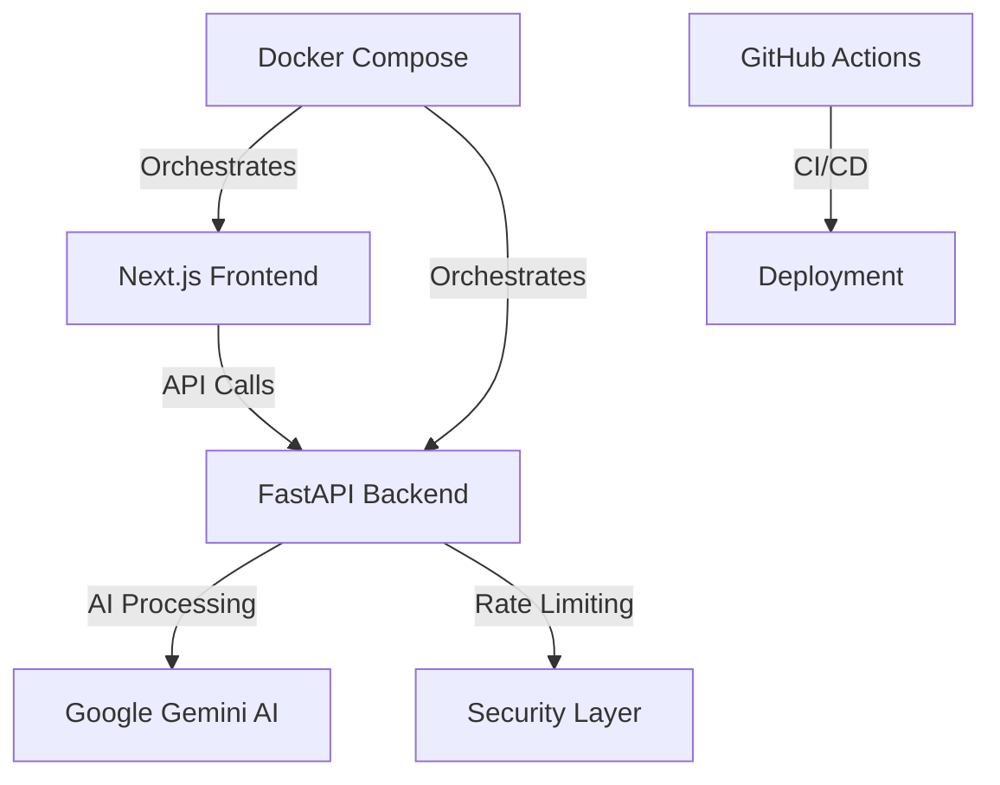

# 🎬 Vido AI - AI-Powered Content Generation Assistant

<div align="center">


**Modern web application for AI-powered content generation tailored for social media platforms. Powered by Google Gemini AI for platform-specific, tone-adjusted, and multilingual content creation.**

[🚀 Live Demo](https://vido-ai.vercel.app) • [📖 Documentation](https://github.com/Yemresalcan/vido-ai/wiki) • [🇹🇷 Türkçe](./README.tr.md)

</div>

---

## ✨ Features

### 🎯 Multi-Platform Support
- **📱 Instagram** - Visual-focused content with engaging captions
- **🎵 TikTok** - Short-form video content that goes viral  
- **📺 YouTube** - Long-form video descriptions and titles
- **🐦 Twitter** - Concise and impactful tweets

### 🎭 Tone Customization
- **💼 Professional** - Business and corporate content
- **🤗 Friendly** - Personal brand and casual content
- **😄 Funny** - Humorous and entertaining posts
- **📚 Educational** - Informative and instructional content
- **💪 Motivational** - Inspiring and empowering messages
- **🎯 Serious** - Formal and authoritative tone

### 🌍 Multilingual Support
- **🇹🇷 Turkish** and **🇺🇸 English** full support
- AI outputs and interface in both languages
- Automatic language detection and adaptation

### 🎨 Modern UI/UX
- AI-themed glassmorphism design
- Fully responsive and mobile-friendly
- Dark mode optimized interface
- Smooth animations and micro-interactions
- Real-time error handling and feedback

---

## 🏗️ Architecture

<div align="center">



</div>

```
vido-ai/
├── 🎨 vido-site/              # Next.js Frontend
│   ├── components/            # React components
│   ├── pages/                # Next.js pages
│   ├── types/                # TypeScript definitions
│   └── public/               # Static assets
│
├── 🔧 app/                   # Python Backend (FastAPI)
│   ├── vido_api.py          # API endpoints
│   ├── vido.py              # AI logic & content generation
│   └── requirements.txt     # Python dependencies
│
├── 🐳 Docker Files           # Containerization
├── 🔄 .github/workflows/     # CI/CD pipelines
└── 📚 Documentation
```

---

## 🚀 Quick Start

### 📋 Prerequisites

- **Python 3.9+**
- **Node.js 18+**
- **Google Gemini AI API Key** ([Get yours here](https://aistudio.google.com/app/apikey))

### 🐳 Docker Setup (Recommended)

1. **Clone the repository**
   ```bash
   git clone https://github.com/Yemresalcan/vido-ai.git
   cd vido-ai
   ```

2. **Configure environment**
   ```bash
   cp app/env.example app/.env
   echo "GEMINI_API_KEY=your_actual_api_key_here" >> app/.env
   ```

3. **Launch with Docker Compose**
   ```bash
   # Production mode
   docker-compose up -d
   
   # Development mode (with hot reload)
   docker-compose -f docker-compose.dev.yml up -d
   ```

4. **Access the application**
   - 🌐 **Frontend**: [http://localhost:3000](http://localhost:3000)
   - ⚡ **Backend**: [http://localhost:8000](http://localhost:8000)
   - 📖 **API Docs**: [http://localhost:8000/docs](http://localhost:8000/docs)

### 💻 Manual Installation

<details>
<summary>Click to expand manual setup instructions</summary>

#### Backend Setup
```bash
cd app
python -m venv venv
source venv/bin/activate  # Linux/Mac
# venv\Scripts\activate    # Windows

pip install -r requirements.txt
cp env.example .env
# Add your GEMINI_API_KEY to .env file

python vido_api.py
```

#### Frontend Setup
```bash
cd vido-site
npm install
npm run dev
```

</details>

---

## 🔧 Usage

### 🎮 Web Interface

1. **Open** [http://localhost:3000](http://localhost:3000)
2. **Select language** 🇹🇷/🇺🇸 using flag buttons
3. **Choose platform** (Instagram, TikTok, YouTube, Twitter)
4. **Pick tone** (Professional, Friendly, Funny, etc.)
5. **Enter keyword** or topic description
6. **Generate content** with AI magic ✨

### 📡 API Usage

```bash
# Generate content for Instagram with professional tone
curl "http://localhost:8000/generate_snippet_and_keywords?prompt=coffee&platform=instagram&tone=profesyonel&language=english"

# Response
{
  "snippet": "Discover the perfect morning ritual with our premium coffee blend ☕",
  "keywords": ["coffee", "morning", "premium", "blend", "ritual"]
}
```

---

## 🛠️ Tech Stack

### 🎨 Frontend
| Technology | Purpose | Version |
|------------|---------|---------|
| **Next.js** | React framework | 13+ |
| **TypeScript** | Type safety | 5.2+ |
| **Tailwind CSS** | Styling | 3.3+ |
| **React Icons** | Icon library | Latest |

### ⚡ Backend
| Technology | Purpose | Version |
|------------|---------|---------|
| **FastAPI** | Python web framework | 0.104+ |
| **Google Gemini AI** | Content generation | Latest |
| **Uvicorn** | ASGI server | 0.24+ |
| **Python-dotenv** | Environment management | 1.0+ |

### 🔧 DevOps
| Technology | Purpose |
|------------|---------|
| **Docker & Docker Compose** | Containerization |
| **GitHub Actions** | CI/CD Pipeline |

---

## 📡 API Reference

### Base URL
```
http://localhost:8000
```

### Endpoints

#### `GET /generate_snippet_and_keywords`

Generate AI content with keywords for social media platforms.

**Parameters:**
| Parameter | Type | Required | Default | Description |
|-----------|------|----------|---------|-------------|
| `prompt` | string | ✅ | - | Content topic or keyword |
| `platform` | string | ❌ | `instagram` | Target platform |
| `tone` | string | ❌ | `eglenceli` | Content tone |
| `language` | string | ❌ | `turkish` | Output language |

**Valid Values:**
- **Platforms**: `instagram`, `tiktok`, `youtube`, `twitter`
- **Tones**: `eglenceli`, `profesyonel`, `motivasyonel`, `komik`, `ciddi`, `samimi`
- **Languages**: `turkish`, `english`

**Example Response:**
```json
{
  "snippet": "Transform your morning routine with premium artisan coffee ☕✨",
  "keywords": ["coffee", "morning", "premium", "artisan", "routine"]
}
```

### Rate Limiting
- **Limit**: 10 requests per minute per IP
- **Headers**: Rate limit info in response headers

---

## 🔧 Troubleshooting

<details>
<summary><strong>🔴 Backend Connection Error</strong></summary>

```bash
# Check if backend is running
curl http://localhost:8000/docs

# If not running
cd app
python vido_api.py

# Check logs
docker-compose logs backend
```

</details>

<details>
<summary><strong>🔴 Gemini API Error</strong></summary>

```bash
# Verify API key
echo $GEMINI_API_KEY

# Check .env file
cat app/.env | grep GEMINI_API_KEY

# Test API key
curl -H "Authorization: Bearer $GEMINI_API_KEY" https://generativelanguage.googleapis.com/v1/models
```

</details>

<details>
<summary><strong>🔴 Docker Issues</strong></summary>

```bash
# Restart containers
docker-compose down
docker-compose up --build -d

# View logs
docker-compose logs -f

# Clean Docker cache
docker system prune -a
```

</details>

---

## 📸 Screenshots

<div align="center">

### 🎨 Main Interface

*AI-powered content generation interface with platform and tone selection*

### 📱 Mobile Responsive

*Fully responsive design optimized for mobile devices*

### ⚡ API Documentation

*Interactive FastAPI documentation with Swagger UI*

</div>

---

## 🤝 Contributing

We welcome contributions! Please see our [Contributing Guidelines](CONTRIBUTING.md) for details.

### 🔄 Development Workflow

1. **Fork** the repository
2. **Create** a feature branch (`git checkout -b feature/amazing-feature`)
3. **Commit** changes (`git commit -m 'Add amazing feature'`)
4. **Push** to branch (`git push origin feature/amazing-feature`)
5. **Open** a Pull Request

### 📋 Development Standards

- **Code Style**: Python (PEP8), JavaScript/TypeScript (Prettier)
- **Commit Messages**: [Conventional Commits](https://conventionalcommits.org/)
- **Test Coverage**: Minimum 80% for PRs
- **Documentation**: Update README for new features

## 🏷️ Releases

### Creating a New Release

For maintainers to create a new release:

```bash
# Linux/Mac
./scripts/create-release.sh 1.0.0

# Windows
scripts\create-release.bat 1.0.0
```

This will automatically:
- Update version numbers in all files
- Create and push a git tag
- Trigger GitHub Actions to:
  - Create a GitHub release
  - Build and push Docker images
  - Generate release notes from CHANGELOG.md

### Release Assets

Each release includes:
- **Source code** (zip & tar.gz)
- **Docker images** on Docker Hub
- **Automatic release notes** from CHANGELOG.md
- **Installation instructions**

---

## 📄 License

This project is licensed under the **MIT License** - see the [LICENSE](LICENSE) file for details.

---

## 👨‍💻 Author & Contact

<div align="center">

**Yunus Emre Salcan**

[](https://github.com/Yemresalcan)
[](https://linkedin.com/in/yunusemresalcan)
[](https://twitter.com/yesdev_exe)
[](https://www.youtube.com/channel/UCeRpo6-m4ieownGFGaDNFiw)
[](https://www.instagram.com/yemresalcan)

📧 **Email**: yunusemresalcan@gmail.com

</div>

---

## 🌟 Support

If you find this project helpful, please consider:

- ⭐ **Starring** the repository
- 🐛 **Reporting** bugs and issues
- 💡 **Suggesting** new features
- 🤝 **Contributing** to the codebase

---

<div align="center">

**⚡ Powered by AI • 🚀 Built with passion • 🌟 Open Source**

[](https://github.com/Yemresalcan/vido-ai/releases/latest)
[](https://hub.docker.com/r/yemresalcan/vido-ai-backend)

Made with ❤️ by [Yunus Emre Salcan](https://github.com/Yemresalcan)

</div> 